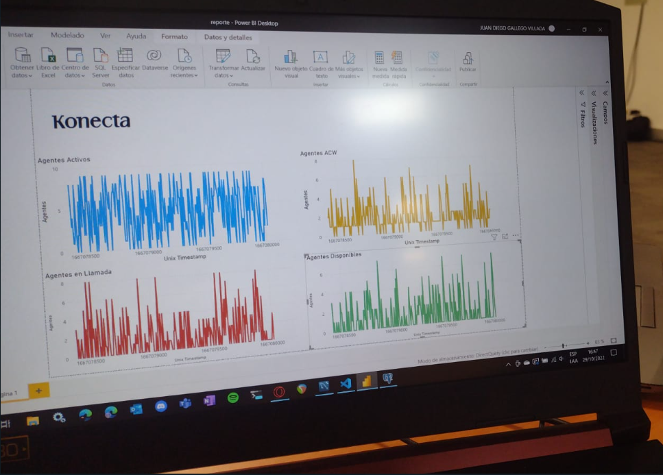

# RetoKonecta2022

## Stack propuesto
- Consumo de APIs: Python sobre instancia de Amazon EC2
- Front/Visualizador: PowerBI
- Nube: AWS
- Base de datos: Amazon RDS
- Seguridad: OAuth

**Roles:**
- Wilson: Backend
- Victor: Ssguridad
- Juan José: Base de datos
- Juan Diego: Visualización/Front
- Daniel: Scrum Master/Backend

## Stack usado
- Consumo de APIs: Python en local
- Front/Visualizador: PowerBI
- Base de datos: Postgres

## Resultados
Se logra la lectura y procesamiento de los mensajes en tiempo real (tasa de refresco de 6 segundos), así como la carga de estos datos de forma tabular a una báse de datos relacional para finalmente visualizarlos en un tablero de Power BI utilizando Direct Query.

